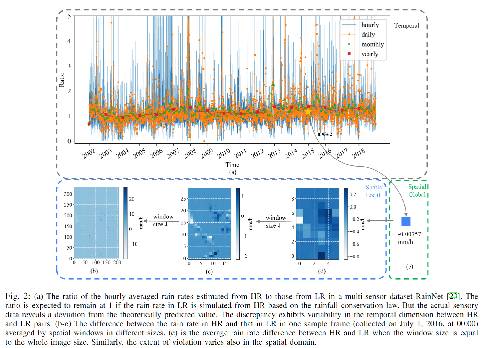
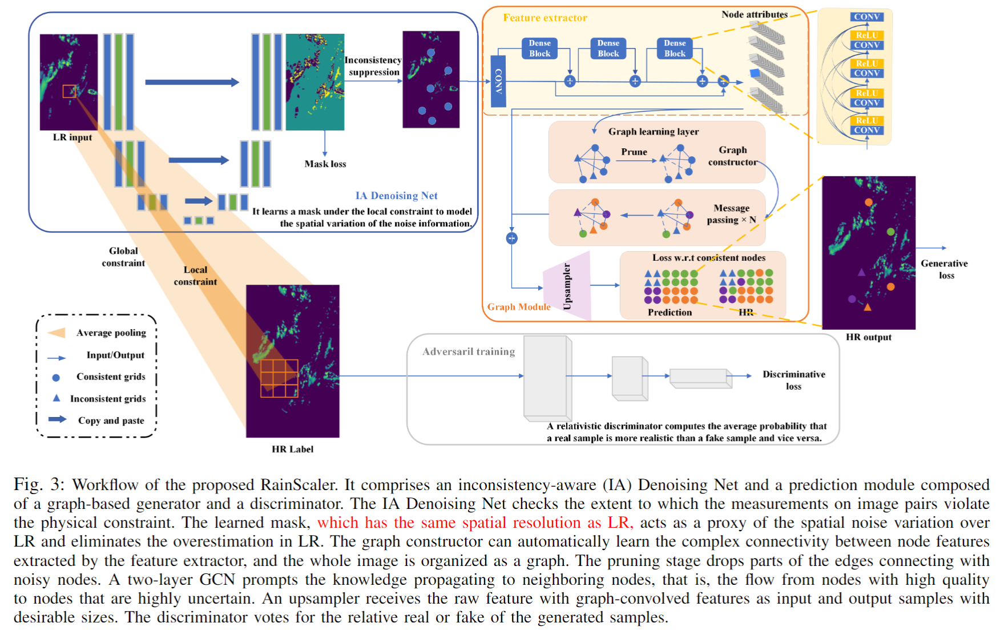
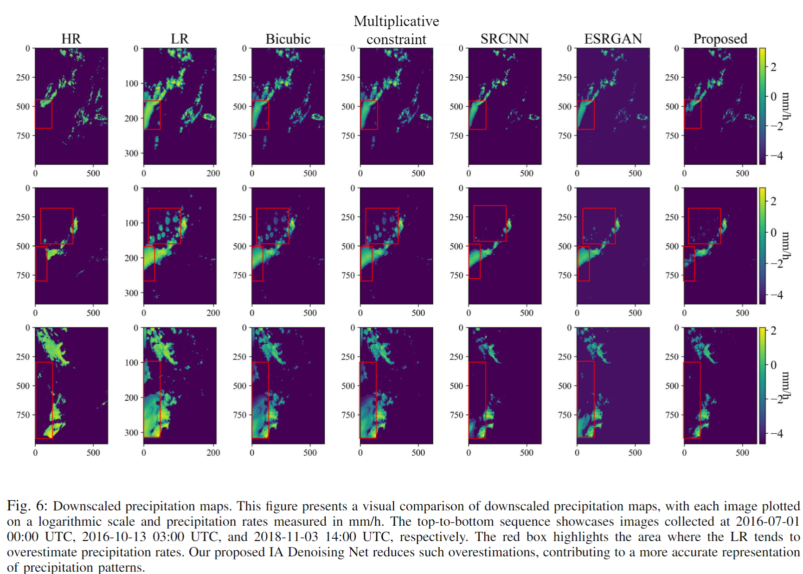

# RainScaler: A Noise-aware Physics-conditioned Network for Precipitation Downscaling

A GNN-based spatial downscaling of precipitation framework. It tries to incoperate physcial knowledge into DL models in the presence of noise or limited data quality.

## Inconsistency between precipitation estimated from HR and LR


## Model

## Baseline Models
SRCNN, Multiplicaitve constraints, ESRGAN, SRGAN

## Dataset
The models are trained and validated on the RainNet Dataset, which contains 62,424 low resolution (LR) (208×333 pixels) and high resolution (HR) (624×999 pixels) precipitation map pairs from the years 2006 to 2018. The detailed information of the dataset can be found at https://github.com/neuralchen/RainNet

## Model Training
The configurations of the models are under ```src_masked_graph/deep_learning/options```

The training scripts are under ```src_masked_graph/methods```

## Results - Visual comparison


